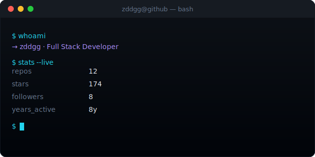

<div align="center">



热爱技术｜持续探索｜创造有价值的软件

</div>

---

## 👨‍💻 About Me

```java
public class Zddgg {

    String role = "Full Stack Developer";

    String[] focus = {
        "API Gateway",
        "Spring Boot",
        "Netty",
        "Vue",
        "Android"
    };

    String currentGoal =
        "Build awesome products";

}
```

---

## ⚡ Tech Stack

<table align="center">
  <tr>
    <td align="right" valign="middle"><b>Languages</b></td>
    <td align="left"></td>
  </tr>
  <tr>
    <td align="right" valign="middle"><b>Frontend</b></td>
    <td align="left"></td>
  </tr>
  <tr>
    <td align="right" valign="middle"><b>Backend</b></td>
    <td align="left"></td>
  </tr>
  <tr>
    <td align="right" valign="middle"><b>Data</b></td>
    <td align="left"></td>
  </tr>
  <tr>
    <td align="right" valign="middle"><b>Infra & Tools</b></td>
    <td align="left"></td>
  </tr>
</table>

---

## 📊 GitHub Stats

<div align="center">



</div>

---

## 🔥 Contribution

<div align="center">


</div>

---

## 🐍 Snake Animation

<div align="center">

<picture>
  <source media="(prefers-color-scheme: dark)" srcset="https://raw.githubusercontent.com/zddgg/zddgg/output/github-contribution-grid-snake-dark.svg"/>
  <source media="(prefers-color-scheme: light)" srcset="https://raw.githubusercontent.com/zddgg/zddgg/output/github-contribution-grid-snake.svg"/>
  
</picture>

</div>

---

## ☕ Random Dev Quote

<div align="center">

> "Code is poetry written for machines."

</div>

---

<div align="center">


</div>


