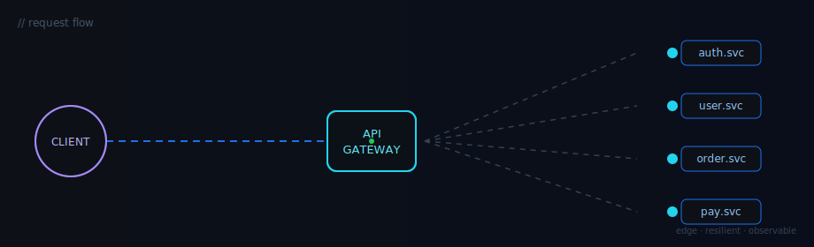

<div align="center">


热爱技术｜持续探索｜创造有价值的软件

</div>

---

## 👨‍💻 About Me

```java
public class Zddgg {

    String role = "Full Stack Developer";

    String[] focus = {
        "API Gateway",
        "Spring Boot",
        "Netty",
        "Vue",
        "Android"
    };

    String currentGoal =
        "Build awesome products";

}
```

---

## ⚡ Tech Stack

<p align="center">


</p>

---

## 🛰️ Request Flow

<div align="center">



</div>

---

## 📊 GitHub Stats

<div align="center">


</div>

---

## 🔥 Contribution

<div align="center">


</div>

---

## 🐍 Snake Animation

<div align="center">

<picture>
  <source media="(prefers-color-scheme: dark)" srcset="https://raw.githubusercontent.com/zddgg/zddgg/output/github-contribution-grid-snake-dark.svg"/>
  <source media="(prefers-color-scheme: light)" srcset="https://raw.githubusercontent.com/zddgg/zddgg/output/github-contribution-grid-snake.svg"/>
  
</picture>

</div>

---

## 🚀 Featured Projects

<a href="https://github.com/zddgg/claude-code">
  
</a>

<a href="https://github.com/zddgg/tiny-img">
  
</a>

---

## ☕ Random Dev Quote

<div align="center">

> "Code is poetry written for machines."

</div>

---

<div align="center">


</div>


